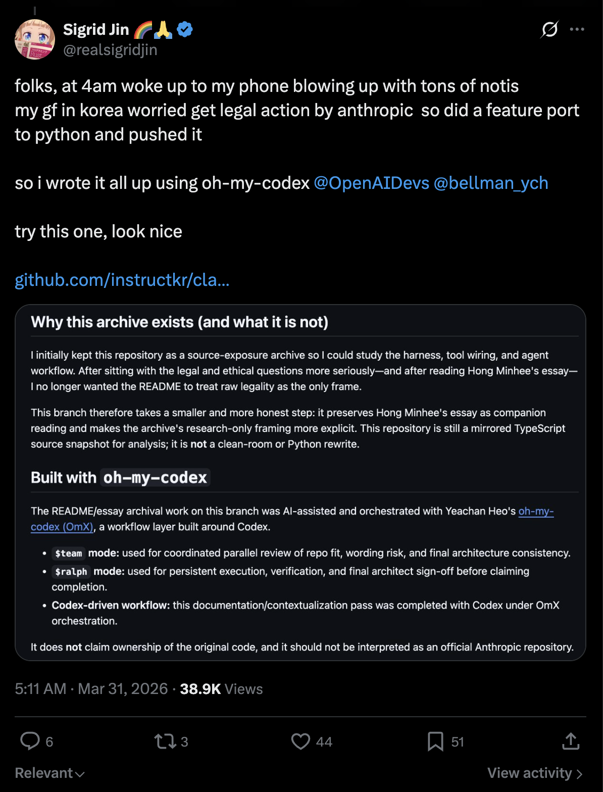
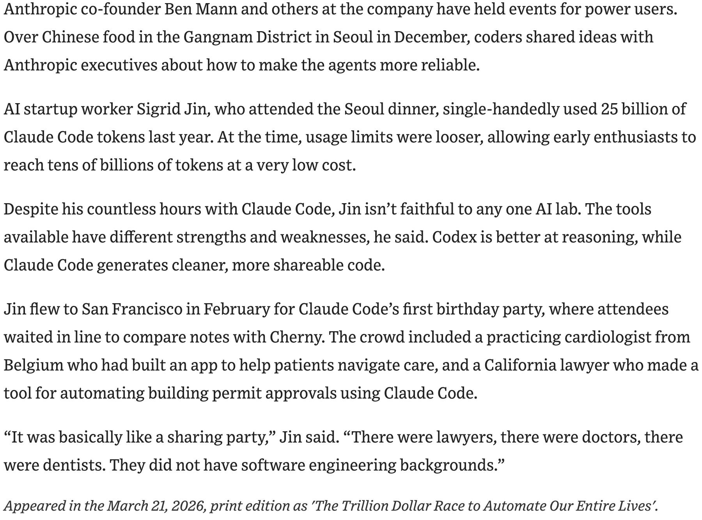

# Claude Code Python Porting Workspace

> The primary `src/` tree in this repository is now dedicated to **Python porting work**. The March 31, 2026 Claude Code source exposure is part of the project's background, but the tracked repository is now centered on Python source rather than the exposed TypeScript snapshot.

---

## Backstory

folks, at 4am woke up to my phone blowing up with tons of notis
my gf in korea worried get legal action by anthropic  so did a feature port to python and pushed it

so i wrote it all up using [oh-my-codex](https://github.com/Yeachan-Heo/oh-my-codex) [@OpenAIDevs](https://x.com/OpenAIDevs) [@bellman_ych](https://x.com/bellman_ych)

try this one, look nice

https://github.com/instructkr/claude-code



I've been deeply interested in **harness engineering** — studying how agent systems wire tools, orchestrate tasks, and manage runtime context. This isn't a sudden thing. The Wall Street Journal featured my work earlier this month, documenting how I've been one of the most active power users exploring these systems:

> AI startup worker Sigrid Jin, who attended the Seoul dinner, single-handedly used 25 billion of Claude Code tokens last year. At the time, usage limits were looser, allowing early enthusiasts to reach tens of billions of tokens at a very low cost.
>
> Despite his countless hours with Claude Code, Jin isn't faithful to any one AI lab. The tools available have different strengths and weaknesses, he said. Codex is better at reasoning, while Claude Code generates cleaner, more shareable code.
>
> Jin flew to San Francisco in February for Claude Code's first birthday party, where attendees waited in line to compare notes with Cherny. The crowd included a practicing cardiologist from Belgium who had built an app to help patients navigate care, and a California lawyer who made a tool for automating building permit approvals using Claude Code.
>
> "It was basically like a sharing party," Jin said. "There were lawyers, there were doctors, there were dentists. They did not have software engineering backgrounds."
>
> — *The Wall Street Journal*, March 21, 2026, [*"The Trillion Dollar Race to Automate Our Entire Lives"*](https://lnkd.in/gs9td3qd)



---

## Porting Status

The main source tree is now Python-first.

- `src/` contains the active Python porting workspace
- `tests/` verifies the current Python workspace
- the exposed snapshot is no longer part of the tracked repository state

The current Python workspace is not yet a complete one-to-one replacement for the original system, but the primary implementation surface is now Python.

## Why this rewrite exists

I originally studied the exposed codebase to understand its harness, tool wiring, and agent workflow. After spending more time with the legal and ethical questions—and after reading the essay linked below—I did not want the exposed snapshot itself to remain the main tracked source tree.

This repository now focuses on Python porting work instead.

## Repository Layout

```text
.
├── src/                                # Python porting workspace
│   ├── __init__.py
│   ├── commands.py
│   ├── main.py
│   ├── models.py
│   ├── port_manifest.py
│   ├── query_engine.py
│   ├── task.py
│   └── tools.py
├── tests/                              # Python verification
├── assets/omx/                         # OmX workflow screenshots
├── 2026-03-09-is-legal-the-same-as-legitimate-ai-reimplementation-and-the-erosion-of-copyleft.md
└── README.md
```

## Python Workspace Overview

The new Python `src/` tree currently provides:

- **`port_manifest.py`** — summarizes the current Python workspace structure
- **`models.py`** — dataclasses for subsystems, modules, and backlog state
- **`commands.py`** — Python-side command port metadata
- **`tools.py`** — Python-side tool port metadata
- **`query_engine.py`** — renders a Python porting summary from the active workspace
- **`main.py`** — a CLI entrypoint for manifest and summary output

## Quickstart

Render the Python porting summary:

```bash
python3 -m src.main summary
```

Print the current Python workspace manifest:

```bash
python3 -m src.main manifest
```

List the current Python modules:

```bash
python3 -m src.main subsystems --limit 16
```

Run verification:

```bash
python3 -m unittest discover -s tests -v
```

Run the parity audit against the local ignored archive (when present):

```bash
python3 -m src.main parity-audit
```

Inspect mirrored command/tool inventories:

```bash
python3 -m src.main commands --limit 10
python3 -m src.main tools --limit 10
```

## Current Parity Checkpoint

The port now mirrors the archived root-entry file surface, top-level subsystem names, and command/tool inventories much more closely than before. However, it is **not yet** a full runtime-equivalent replacement for the original TypeScript system; the Python tree still contains fewer executable runtime slices than the archived source.

## Related Essay

- [*Is legal the same as legitimate: AI reimplementation and the erosion of copyleft*](https://writings.hongminhee.org/2026/03/legal-vs-legitimate/)

The essay is dated **March 9, 2026**, so it should be read as companion analysis that predates the **March 31, 2026** source exposure that motivated this rewrite direction.

## Built with `oh-my-codex`

The restructuring and documentation work on this repository was AI-assisted and orchestrated with Yeachan Heo's [oh-my-codex (OmX)](https://github.com/Yeachan-Heo/oh-my-codex), layered on top of Codex.

- **`$team` mode:** used for coordinated parallel review and architectural feedback
- **`$ralph` mode:** used for persistent execution, verification, and completion discipline
- **Codex-driven workflow:** used to turn the main `src/` tree into a Python-first porting workspace

### OmX workflow screenshots


*Ralph/team orchestration view while the README and essay context were being reviewed in terminal panes.*


*Split-pane review and verification flow during the final README wording pass.*

## Ownership / Affiliation Disclaimer

- This repository does **not** claim ownership of the original Claude Code source material.
- This repository is **not affiliated with, endorsed by, or maintained by Anthropic**.
